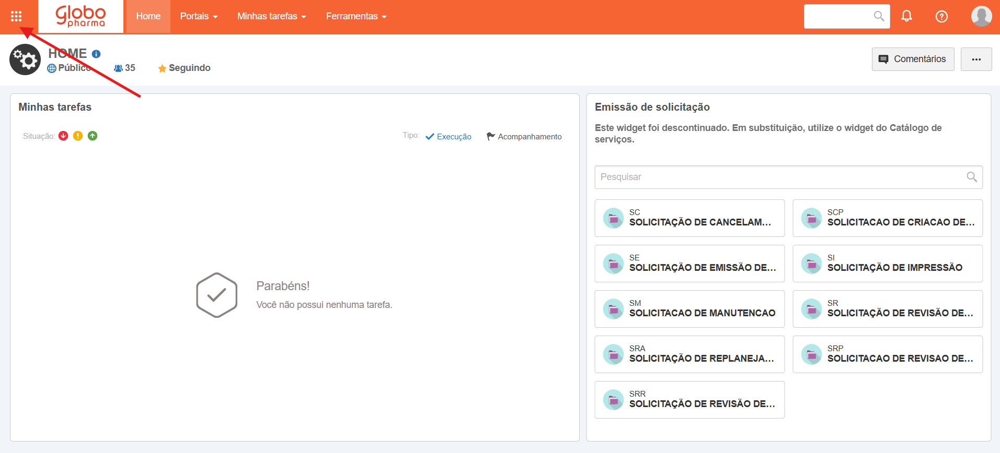
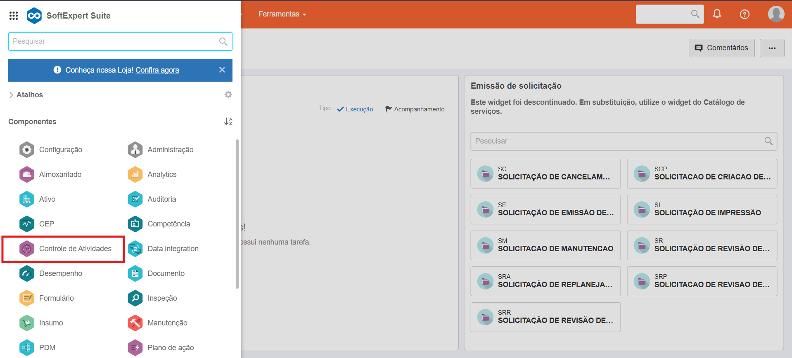
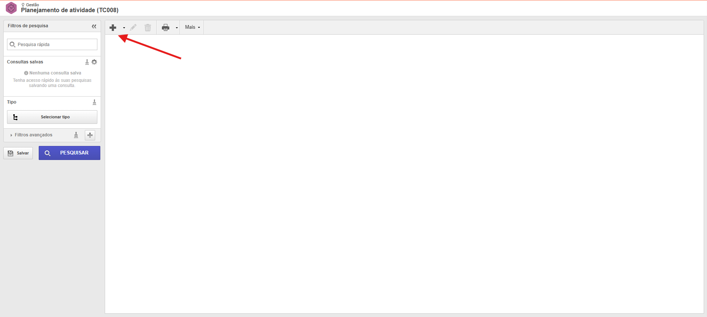
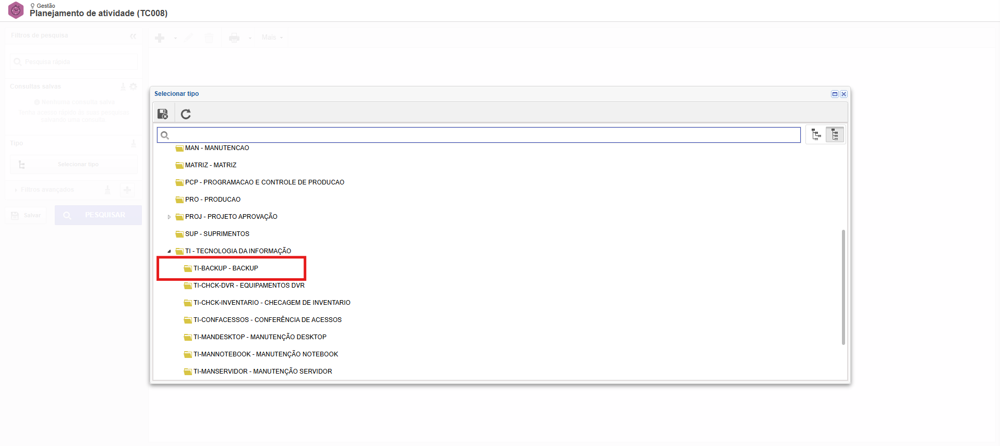
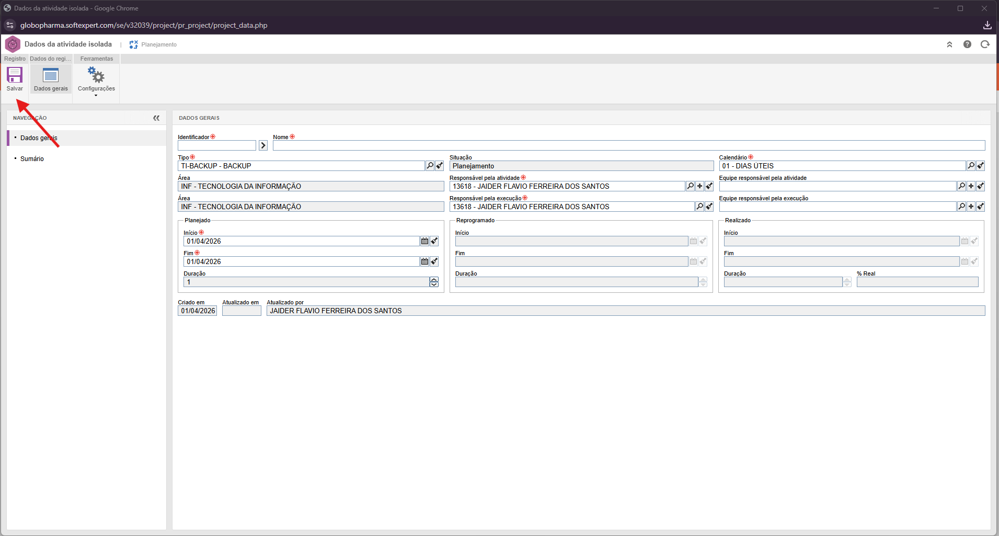
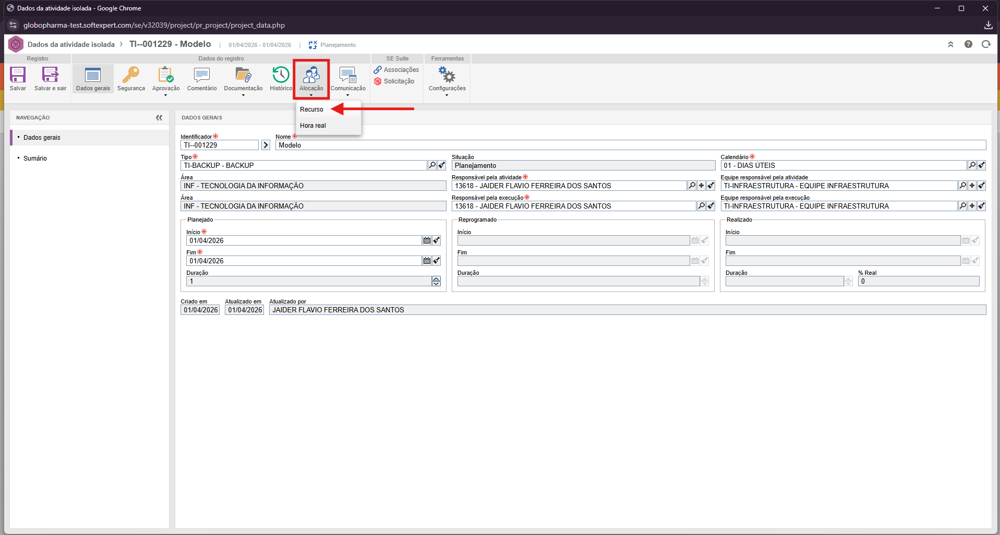
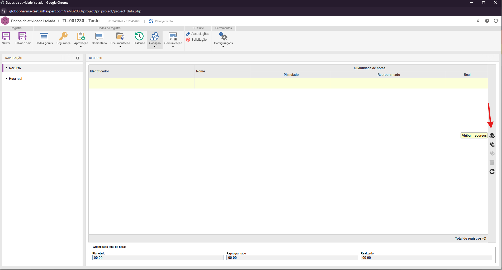
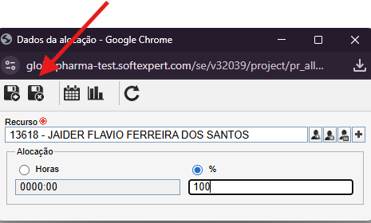
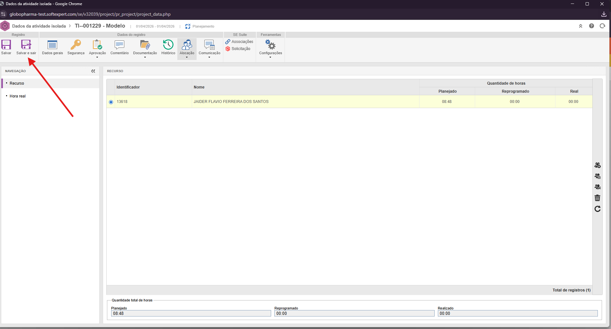
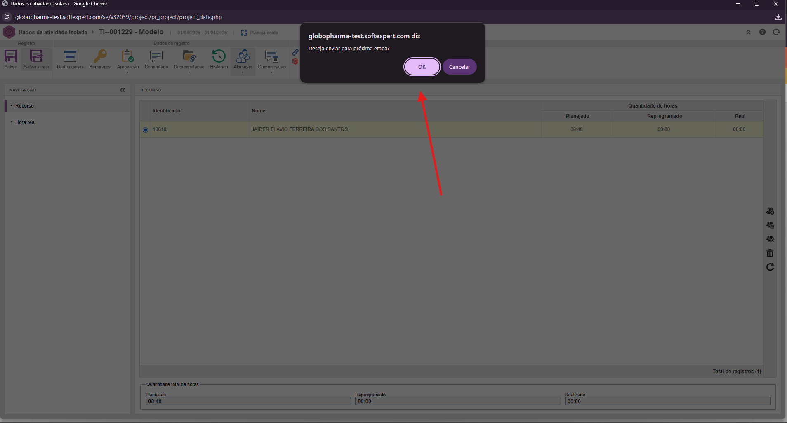

# Cadastro de Atividade de Backup

!!! info "Objetivo"
    Este procedimento estabelece as diretrizes e o passo a passo para o cadastro e planejamento de tarefas de backup no sistema **SE Suite (Versão 2.2.4)**.

## Procedimento Passo a Passo

1. Para iniciar o processo, acesse a tela de planejamentos **Planejamento de atividade (TC0008)** através do menu superior lateral.

2. Com a tela de planejamento aberta, clique no ícone de **adição (+)** localizado no canto superior esquerdo para criar uma nova atividade.

3. No menu suspenso que será aberto, localize a categoria **TI - TECNOLOGIA DA INFORMAÇÃO** e selecione o tipo de atividade correspondente ao backup.

4. Na tela **Dados da atividade isolada**, preencha as informações obrigatórias e de planejamento:
    * **Identificador** e **Nome** da atividade.
    * **Datas** (início e fim do planejamento).
    * **Responsável** pela atividade.
    * **Equipe** que irá executar a tarefa.
    
    > **Nota:** Após preencher os dados, clique no botão **Salvar**, localizado no canto superior esquerdo.

5. Com a atividade salva, clique no ícone **Alocação** e, em seguida, selecione a opção **Recurso**.

6. Na nova tela, clique no ícone de **Adição de recursos** na barra lateral direita. Selecione o recurso (pessoa ou ferramenta) que irá executar a tarefa, defina a porcentagem (**%**) de dedicação/alocação e clique em **Salvar e sair**.

7. Após retornar à tela principal com todos os dados e recursos devidamente preenchidos, selecione a opção **Salvar e sair** no canto superior esquerdo.

8. Por fim, confirme a ação clicando em **OK** na mensagem exibida para enviar a atividade para a fila de execução.

