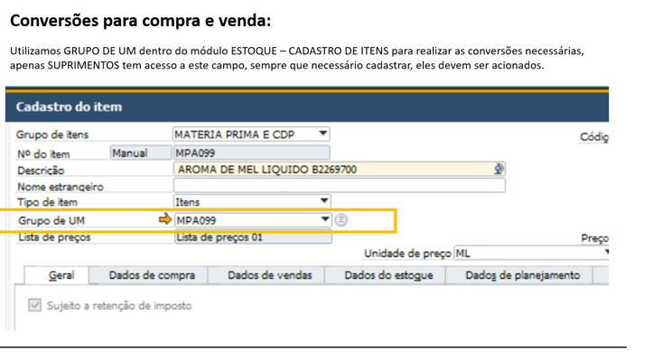
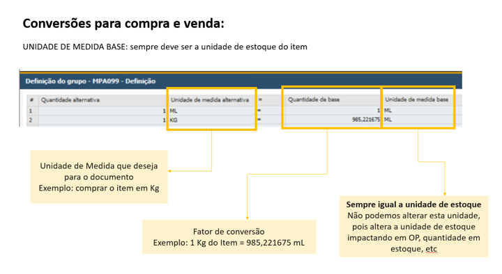

# Procedimento para cadastro de conversões de UM
Percebemos que vários colaboradores estavam com dúvidas referente a conversão de unidade dentro do SAP, de forma simplificada as conversões estão acontecendo dentro do sistema conforme explicação abaixo. 
Este GRUPO DE UM é utilizado tanto para conversões tanto dentro dos documentos de compra quanto para documentos de venda:

